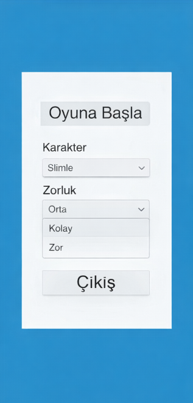
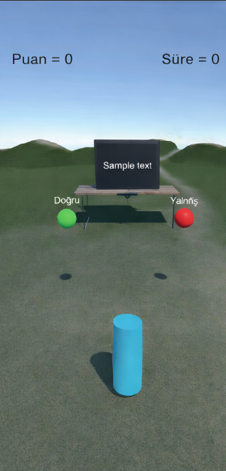
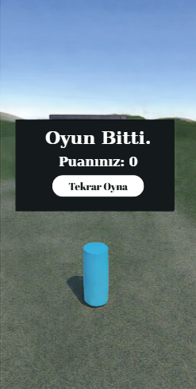

# 🎮 Kelime Macerası: Dil Bilgisi Temalı Unity 3D Oyunu

**Kelime Macerası**, temel dil bilgisi ve yazım kurallarını interaktif bir 3D dünyada öğreten açık kaynaklı bir eğitim oyunudur. Unity motoru ve C# kullanılarak geliştirilen bu proje, yazılım öğrenme sürecimdeki ilk teknik çıktılardan biridir.

## 🖼️ Oyun Ekran Görüntüleri

| Başlangıç Ekranı | Oyun İçi Sahne | Oyun Sonu |
| :---: | :---: | :---: |
|  |  |  |

## 🕹️ Oyunun Mantığı ve Oynanış
Oyun, oyuncunun dil bilgisi bilgisini reflekslerle birleştirir:
* **Karar Mekanizması:** Ekranda beliren kelimenin yazımı doğru ise yeşil küreye, yanlış ise kırmızı küreye temas ederek puan toplanır.
* **Zorluk Ayarları:** "Kolay", "Orta" veya "Zor" modlar seçilebilir.

## 🛠️ Teknik Özellikler ve Geliştirme
Bu proje tamamen **açık kaynaklıdır**. İlgilenen herkes:
* **Kaynak kodlarını** indirebilir ve Unity ile açıp inceleyebilir.
* Proje üzerinde **değişiklikler yapabilir**, kendi kelime listelerini ekleyebilir veya mekanikleri geliştirebilir.
* **Motor:** Unity 3D
* **Programlama:** C#

## 🔒 Lisans
Bu proje **MIT LICENSE** lisansı ile sunulmaktadır. Bilginin özgürce paylaşılması ve geliştirilmesi amacıyla tüm hakları kamuya açıktır.
